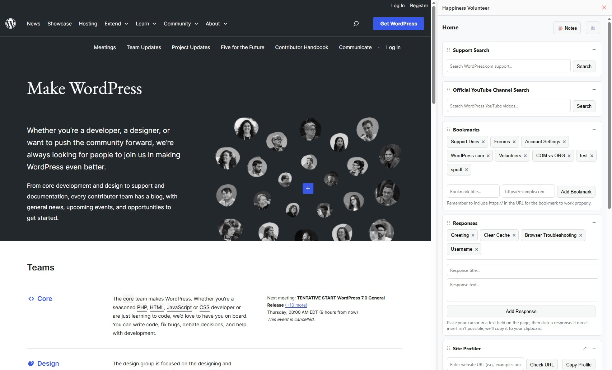

# Happiness Volunteer Extension

> **Unofficial** support tools for WordPress.com Forum Volunteers

A Chrome/Edge **side panel extension** designed to help WordPress.com Forum Volunteers provide technical support to the community. This extension opens a convenient side panel in your browser, allowing you to access support tools while working with forum users without switching tabs.



## ⚠️ Disclaimer

This extension is **not officially affiliated with or endorsed by Automattic or WordPress.com**. It is an independent tool created by volunteers to assist other volunteers providing technical support.

## ✨ Features

- **🔍 Support Search** - Quick search for WordPress.com support articles
- **📺 YouTube Search** - Search official WordPress.com YouTube channel
- **🔖 Bookmarks** - Manage custom bookmarks with add/delete functionality
- **💬 Responses** - Create and manage custom response templates
- **📊 Site Profiler** - Analyze WordPress.com sites with built-in profiler
- **📝 Notes** - Take and manage notes with timestamps and CSV export
- **⚙️ Settings** - Customize section visibility and access helpful resources
- **📋 Common Issues** - Quick reference for common support issues
- **🚀 Escalation Guidelines** - Know when and how to escalate issues
- **🏷️ Tag Copying** - One-click copy of forum moderation tags

## 🎯 Installation

### From Chrome Web Store (Coming Soon)
1. Visit the Chrome Web Store listing
2. Click "Add to Chrome"
3. Click the extension icon to open the side panel

### Manual Installation (Development)
1. Download or clone this repository
2. Open Chrome and go to `chrome://extensions/`
3. Enable "Developer mode" (top right)
4. Click "Load unpacked"
5. Select the extension directory
6. Click the extension icon to open the side panel

## 🛠️ Usage

1. Click the extension icon in your browser toolbar
2. The side panel will open with all available tools
3. Drag and drop sections to reorder them
4. Collapse/expand sections as needed
5. Use the Settings page (⚙️) to hide sections you don't need

## 📚 Resources

- [WordPress.com Volunteers Guide](https://wordpress.com/support/wordpress-com-volunteers/)
- [Forum Community Standards](https://wordpress.com/forums/topic/best-practices-community-standards/)

## 🔧 Development

### Tech Stack
- Manifest V3
- Chrome Side Panel API
- Chrome Storage API
- Vanilla JavaScript (no frameworks)

### File Structure
```
happiness-volunteer-extension/
├── manifest.json           # Extension configuration
├── service-worker.js       # Background service worker
├── content.js             # Content script for text insertion
├── icons/                 # Extension icons
│   ├── icon16.png
│   ├── icon48.png
│   └── icon128.png
└── sidepanels/           # Side panel pages
    ├── tools.html        # Main tools page
    ├── tools.js          # Main tools logic
    ├── tools.css         # Shared styles
    ├── notes.html        # Notes page
    ├── notes.js          # Notes logic
    ├── settings.html     # Settings page
    └── settings.js       # Settings logic
```

## 🤝 Contributing

Contributions are welcome! Please feel free to submit a Pull Request.

## 📄 License

This project is open source and available under the MIT License.

## 💖 Credits

Created with ❤️ by WordPress.com Forum Volunteers for Forum Volunteers

## 🐛 Bug Reports

If you find a bug, please open an issue on GitHub with:
- Description of the bug
- Steps to reproduce
- Expected behavior
- Screenshots (if applicable)

## 🔮 Future Plans

- Firefox Add-on version
- Additional response templates
- More customization options
- Integration with WordPress.com support tools

---

**Note**: This is an unofficial tool. For official WordPress.com support, visit [WordPress.com Support](https://wordpress.com/support/).
